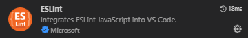
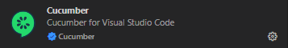
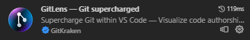
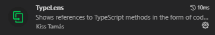
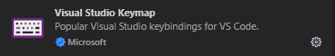

# README

## Prerequisites
### 1. To run locally
- An internet connection to allow browsing to the Demo Web Shop (https://demowebshop.tricentis.com/).

### 2. To run in CI
- Not applicable.

## Required Extensions

This extension must be installed for Eslint to apply linting rules from the `.eslintrc.yml` file:   


This extension must be installed for Cucumber (BDD) support:    


These extensions are recommended:   
  
    
  
  
    
    

## Getting started
First, configure the `.env` file with the correct environment variables.

### 1. Pull dependencies
Open the terminal and run
```powershell
npm i
```

### 2. Run with VS code debugger
1. In the `Run and Debug` pane, choose the project you wish to work with.
1. Run the project via menu (Run -> Start Debugging) or pressing F5 - this builds and runs the tests (of the chosen project) and attaches the debugger so that you can debug using breakpoints.
1. Currently the project represent the 5 browsers to choose to run the tests with. The default is "Google Chrome", but you can change this to your liking.
1. To run a single test, add the `@only` tag to the Scenario you want to run.

### 3. Run with Playwright-test extension
1. Build all the tests (all projects) via menu (Terminal -> Run Build Task...)
1. In the `Testing` pane > `Test Explorer`, expand the tests and click on `Run` for the test you which to run.

## Helpful Resources
- https://playwright.dev/docs/intro
- https://vitalets.github.io/playwright-bdd